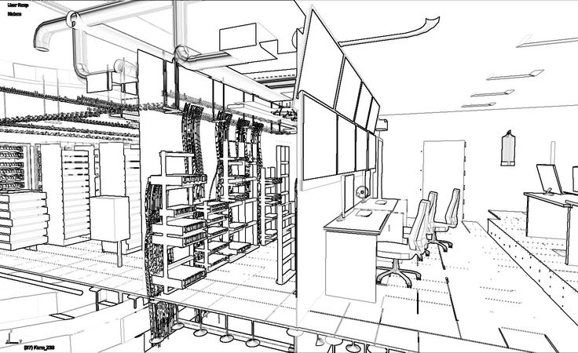

# desktop-tutorial
<!DOCTYPE html>
<html>
<head>
    <title>Data Inf - Data Center</title>
    
</head>
<body>
    

        
        <h1>ROYAL TECH</h1>
    

    

        <h2>¿Quiénes somos?</h2>
        
La empresa Royal Tech es líder en el diseño y la consultoría de centros de datos eficientes y seguros. Nuestro equipo de expertos altamente capacitados y con amplia experiencia en el campo de la informática y la infraestructura de red, se dedica a brindar soluciones personalizadas para empresas de todos los tamaños.

    

    

        <h2>Misión y Visión</h2>
        
Misión: Nuestra misión es proporcionar soluciones de diseño y consultoría de centros de datos eficientes y seguros que impulsen el éxito de nuestros clientes. A través de nuestro equipo de expertos altamente capacitados, nos comprometemos a ofrecer soluciones personalizadas y de vanguardia que optimicen la infraestructura tecnológica de las empresas, permitiéndoles alcanzar sus objetivos estratégicos y maximizar su rendimiento.

        
Visión: Nuestra visión es ser reconocidos como líderes en el diseño y la consultoría de centros de datos a nivel mundial. Nos esforzamos por ser la opción preferida de las empresas que buscan soluciones innovadoras y eficientes para sus necesidades de infraestructura tecnológica. A través de la excelencia en el servicio al cliente, la constante investigación y desarrollo, y la colaboración con socios estratégicos, aspiramos a ser impulsores del crecimiento y el éxito de nuestros clientes en un entorno digital en constante evolución.

    

    

        <h2>Ubicación</h2>
        
Estamos ubicados en la ciudad de Cali.

        
Por la carrera 27 #44-27

    

    

        <h2>Galería de Fotos</h2>
        

        

        

        

    

    

        <h2>Videos</h2>
        <iframe width="560" height="315" src="Instalacion de Kali linux-1.mp4" frameborder="0" allowfullscreen></iframe>
    

    

        <h2>Contacto</h2>
        
Para más información, puedes contactar a Andrés Soto.

    

</body>
</html>
